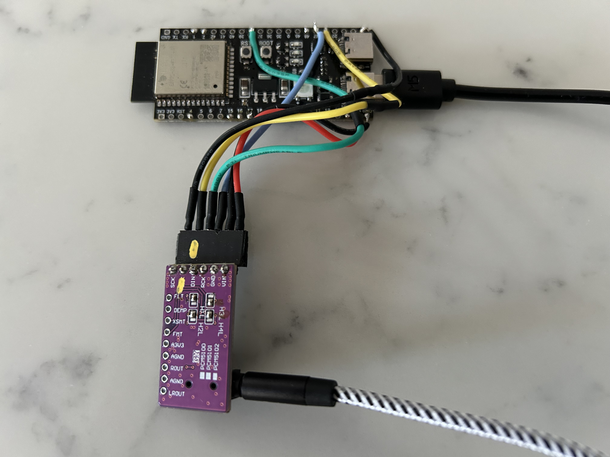

# AmyPlatformIO
## Examples for AMY using PlatformIO and the Arduino Framework

AMY is "a high-performance fixed-point music synthesizer library for microcontrollers" which can be found on Github here:

[https://github.com/shorepine/amy](https://github.com/shorepine/amy)

There are a couple of Arduino examples including two for the ESP32 but these are intended for the Arduino IDE which I don't use anymore. Instead I use PlatformIO extensively.

There was some discussion recently on the AMY discord channel and in the issues on Github about supporting PlatformIO particularly for the ESP32-S3 which is something that I was already working on.

This repositary is an emerging collection of examples for AMY using PlatformIO and the Arduino Framework. To begin with this will primarily be for the ESP32-S3 microcontroller.

### Reference Hardware

For these examples the reference hardware is the same as I used to test TulipCC Headless which is explained here:

[https://github.com/RocketManRC/tulipcc-headless.git](https://github.com/RocketManRC/tulipcc-headless.git)

**In particular note the required jumpers for the PCM5102 board and for 5V power out and USB-OTG for the ESP32-S3.**

In this case I have changed the pin assignments for the connections to the I2S audio board to avoid using the pins with touch capability (GPIO 1 to 14) and other pins that might be problematic. There is a great reference for this here:

[https://github.com/atomic14/esp32-s3-pinouts](https://github.com/atomic14/esp32-s3-pinouts)

In my case I have used only pins 21, 47 and 38.

| ESP32 | PCM5102 | Wire Colour |
| ---------- | --------- | ---------
| 5Vin       | VIN       | Red
| GND        | GND       | Black
| 47         | LCK       | Blue
| 38         | DIN       | Green
| 21         | BCK       | Yellow
| GND        | SCK       | Black

### PlatformIO and AMY ###

The AMY support for Arduino on the ESP32 uses version 3 of arduino-esp32 and this is not currently directly supported by PlatformIO. There is however a community supported version of PlatformIO which I have found works perfectly. 

All settings for a PlatformIO project are contained in the file platformio.ini and this has been provided for each example. Opening the folder for the example in Visual Studio Code which has the platformio extension installed will automatically download the necesary files and then building the project will complete the setup of the project.

### The Examples - Work in Progress... ###

The examples are in subfolders of the repository. For each example you will have to edit the source file to change the pin assignments if you are not using the ones mentioned above.

**ArduinoExamples/AmyLib/AMY_Test_ESP32**

This is the first ESP32 Arduino example in the AMY repository which has been renamed from a .ino file to .cpp and the pin assignments changed.

**ArduinoExamples/AmyLib/AMY_Test_ESP32_DualCore**

This is the second ESP32 Arduino example in the AMY repository which has been renamed from a .ino file to .cpp and the pin assignments changed.

For the above two examples the original .ino files can be found in the ".pio/libdeps/AMY Synthesizer/examples" folder which has been downloaded by PlatformIO.

**ArduinoExamples/AmyExtras/Amy_Test_ESP32_PCM_Samples**

This example plays all the PCM samples using AMY's wire protocol. For microcontrollers AMY will only have 11 PCM sample however this can easily be changed by editing the AMY file amy.c (more details in the source code).

**ArduinoExamples/AmyExtras/Amy_Test_ESP32_Patches**

This example plays all the Juno and DX7 patches using AMY's wire protocol. This is almost identical to the PCM_Samples example except the patches
playcontinuously so need to be turned off.

**ArduinoExamples/AmyExtras/AMY_Test_ESP32_USB_MIDI**

This example is under development and will be next.